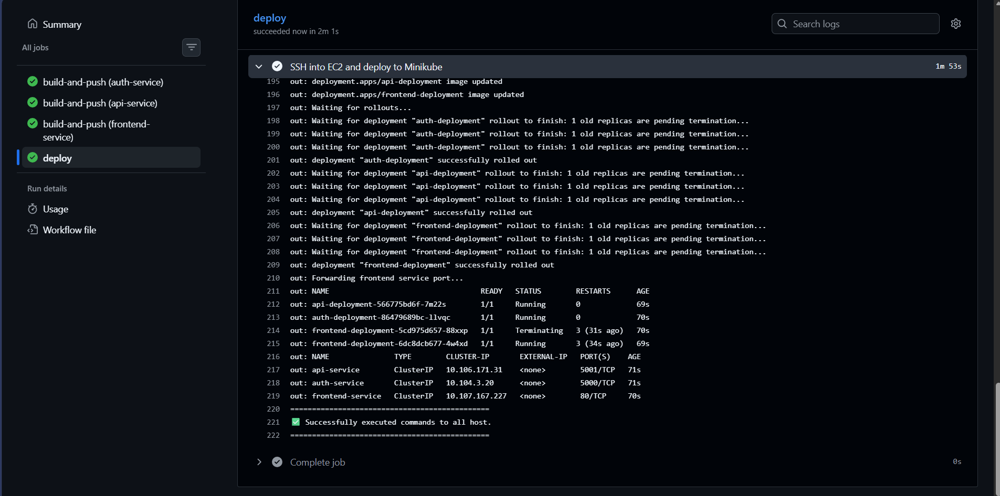
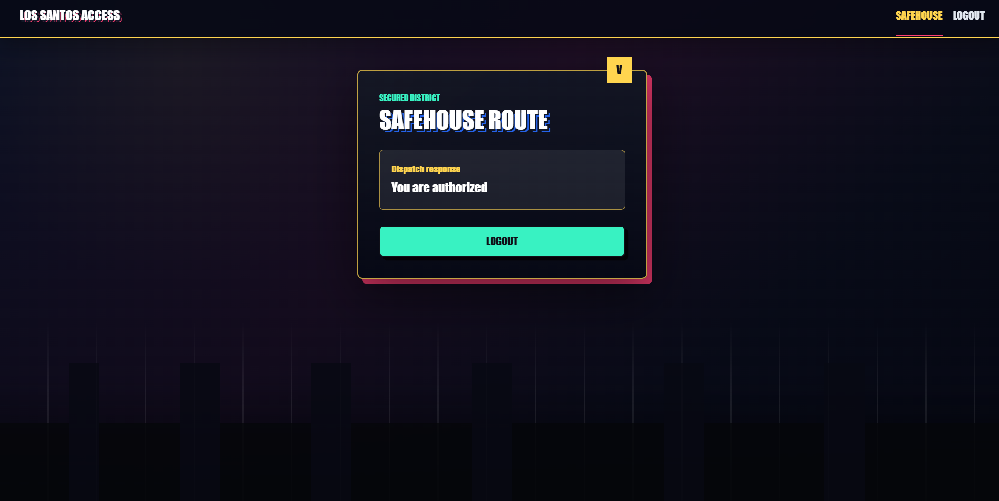
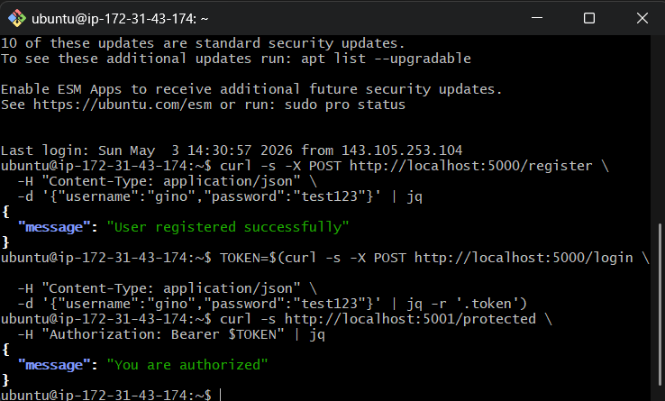
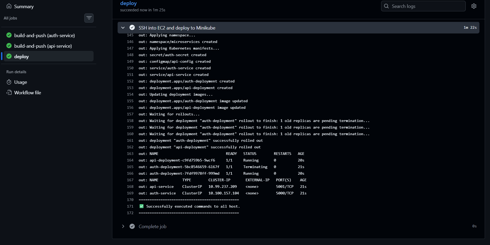
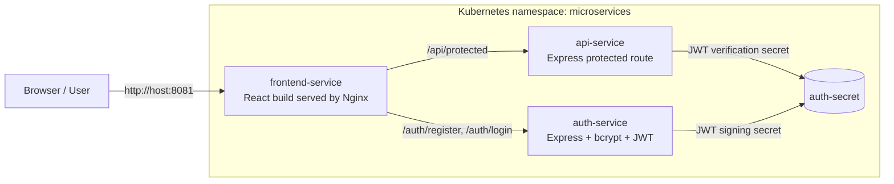

# CI/CD Microservices Kubernetes Demo


A practical microservices deployment lab that starts with two JWT-backed Node.js services, then grows into a full-stack React frontend served by Nginx, containerized with Docker, published to GitHub Container Registry, and deployed to Minikube on an EC2 host through GitHub Actions.

The final app exposes only the frontend. Browser traffic reaches the backend through Nginx proxy routes, so the auth and API services stay internal.

## Table of Contents

- [Demo](#demo)
- [Architecture](#architecture)
- [Phases](#phases)
- [Services](#services)
- [API Reference](#api-reference)
- [Local Development](#local-development)
- [Docker Compose](#docker-compose)
- [Kubernetes Deployment](#kubernetes-deployment)
- [CI/CD](#cicd)
- [GHCR Image Visibility](#ghcr-image-visibility)
- [Project Structure](#project-structure)
- [Troubleshooting](#troubleshooting)

## Demo

> Add the project screenshots to `docs/images/` using the filenames below to render this section in GitHub.

| CI/CD pipeline | Frontend protected route |
| --- | --- |
|  |  |

| API-only phase | Kubernetes rollout |
| --- | --- |
|  |  |

## Architecture



## Phases

### Phase 1: API and Auth Services

The project began as two small Express services:

- `auth-service` on port `5000`
- `api-service` on port `5001`

The auth service owns registration and login. It hashes passwords with `bcryptjs`, signs JWTs, and returns a token from `/login`.

The API service exposes `/protected`, which requires:

```http
Authorization: Bearer <token>
```

This phase validated the backend flow directly with `curl`, then moved the same services into Docker and Kubernetes.

### Phase 2: CI/CD and Kubernetes

The services were added to GitHub Actions:

- CI installs dependencies, runs tests, builds images, and pushes to GHCR.
- CD builds and pushes images, SSHs into an EC2 host, starts Minikube, applies Kubernetes manifests, updates deployment images to the commit SHA, and waits for rollouts.

Kubernetes resources live in `k8s/`:

- `namespace.yaml`
- `auth-secret.yaml`
- `api-config.yaml`
- `auth-service.yaml`
- `api-service.yaml`
- `auth-deployment.yaml`
- `api-deployment.yaml`

### Phase 3: React Frontend and Nginx

The final phase added `frontend-service`:

- React + Vite frontend
- Login page
- Register page
- Protected route page
- Token persisted in `localStorage`
- GTA-inspired visual theme
- Multistage Dockerfile
- Nginx runtime serving static assets on port `80`
- Nginx proxy routes for backend access:
  - `/auth/*` -> `auth-service:5000`
  - `/api/*` -> `api-service:5001`

Kubernetes now also includes:

- `frontend-service.yaml`
- `frontend-deployment.yaml`

The CD pipeline forwards the frontend service from the EC2 host:

```bash
kubectl port-forward --address 0.0.0.0 -n microservices service/frontend-service 8081:80
```

## Services

| Service | Stack | Container port | Purpose |
| --- | --- | ---: | --- |
| `auth-service` | Node.js, Express, bcryptjs, jsonwebtoken | `5000` | Register users and issue JWTs |
| `api-service` | Node.js, Express, jsonwebtoken | `5001` | Serve JWT-protected API responses |
| `frontend-service` | React, Vite, Nginx | `80` | Serve the UI and proxy backend paths |

## API Reference

### Health

```http
GET /health
```

Available on both backend services.

### Register

```http
POST /register
Content-Type: application/json

{
  "username": "gino",
  "password": "test123"
}
```

Response:

```json
{
  "message": "User registered successfully"
}
```

### Login

```http
POST /login
Content-Type: application/json

{
  "username": "gino",
  "password": "test123"
}
```

Response:

```json
{
  "token": "<jwt>"
}
```

### Protected Route

```http
GET /protected
Authorization: Bearer <jwt>
```

Response:

```json
{
  "message": "You are authorized"
}
```

When using the frontend or Nginx container, call these through:

- `/auth/register`
- `/auth/login`
- `/api/protected`

## Local Development

Create a root `.env` file:

```env
JWT_SECRET=replace-with-a-dev-secret
```

Run each service directly:

```powershell
cd auth-service
npm install
npm start
```

```powershell
cd api-service
npm install
npm start
```

```powershell
cd frontend-service
npm install
npm run dev
```

Open:

```text
http://localhost:5173
```

The Vite dev server proxies:

- `/auth` -> `http://localhost:5000`
- `/api` -> `http://localhost:5001`

## Docker Compose

Run the whole stack locally:

```powershell
docker compose up --build
```

Open:

```text
http://localhost:8081
```

Compose publishes:

| Service | Host URL |
| --- | --- |
| Frontend | `http://localhost:8081` |
| Auth service | `http://localhost:5000` |
| API service | `http://localhost:5001` |

## Kubernetes Deployment

Apply the manifests manually:

```bash
kubectl apply -f k8s/namespace.yaml
kubectl apply -f k8s/auth-secret.yaml
kubectl apply -f k8s/api-config.yaml
kubectl apply -f k8s/auth-service.yaml
kubectl apply -f k8s/api-service.yaml
kubectl apply -f k8s/frontend-service.yaml
kubectl apply -f k8s/auth-deployment.yaml
kubectl apply -f k8s/api-deployment.yaml
kubectl apply -f k8s/frontend-deployment.yaml
```

Check rollout status:

```bash
kubectl get pods -n microservices
kubectl get svc -n microservices
kubectl rollout status deployment/auth-deployment -n microservices
kubectl rollout status deployment/api-deployment -n microservices
kubectl rollout status deployment/frontend-deployment -n microservices
```

Forward the frontend:

```bash
kubectl port-forward --address 0.0.0.0 -n microservices service/frontend-service 8081:80
```

Open:

```text
http://<EC2_PUBLIC_IP>:8081
```

Make sure the EC2 security group allows inbound TCP `8081`.

## CI/CD

### CI: `.github/workflows/ci.yaml`

Runs for pull requests and pushes to `main`.

Matrix services:

- `auth-service`
- `api-service`
- `frontend-service`

Each matrix job:

1. Checks out the repository.
2. Sets up Node.js 20.
3. Runs `npm ci`.
4. Runs `npm test`.
5. Builds the Docker image.
6. Pushes `latest` and commit-SHA tags to GHCR on push events.

### CD: `.github/workflows/cd.yaml`

Runs on push to `main`.

The deployment job:

1. Builds and pushes all three service images.
2. SSHs into the EC2 host.
3. Starts Minikube.
4. Pulls the latest repository changes.
5. Applies Kubernetes manifests.
6. Updates each deployment image to `${{ github.sha }}`.
7. Waits for all rollouts.
8. Starts a background frontend port-forward on `8081:80`.

Required GitHub secrets:

| Secret | Purpose |
| --- | --- |
| `EC2_HOST` | Public hostname or IP of the EC2 deployment host |
| `EC2_USER` | SSH username, usually `ubuntu` |
| `EC2_SSH_KEY` | Private SSH key for the EC2 host |
| `GITHUB_TOKEN` | Provided by GitHub Actions for GHCR auth |

## GHCR Image Visibility

If a package image is private, Kubernetes will fail with `ErrImagePull` or `ImagePullBackOff` unless the cluster has a valid image pull secret.

For a demo project, the simplest path is to make the GHCR packages public:

- `ghcr.io/<owner>/auth-service`
- `ghcr.io/<owner>/api-service`
- `ghcr.io/<owner>/frontend-service`

If private images are required, create a GHCR pull secret in the `microservices` namespace and reference it from each deployment.

## Project Structure

```text
.
|-- .github/workflows
|   |-- ci.yaml
|   `-- cd.yaml
|-- api-service
|   |-- Dockerfile
|   |-- package.json
|   `-- src/index.js
|-- auth-service
|   |-- Dockerfile
|   |-- package.json
|   `-- src/index.js
|-- frontend-service
|   |-- Dockerfile
|   |-- nginx.conf
|   |-- package.json
|   `-- src
|-- k8s
|   |-- api-config.yaml
|   |-- api-deployment.yaml
|   |-- api-service.yaml
|   |-- auth-deployment.yaml
|   |-- auth-secret.yaml
|   |-- auth-service.yaml
|   |-- frontend-deployment.yaml
|   |-- frontend-service.yaml
|   `-- namespace.yaml
|-- docker-compose.yml
`-- README.md
```

## Troubleshooting

### Port `8081` is not reachable

Check the port-forward process on the EC2 host:

```bash
cat /tmp/frontend-service-port-forward.log
cat /tmp/frontend-service-port-forward.pid
```

Check if anything is listening:

```bash
sudo ss -ltnp | grep ':8081'
```

### Frontend loads but login/register fails

Check backend service endpoints:

```bash
kubectl get endpoints -n microservices
kubectl logs deployment/auth-deployment -n microservices
kubectl logs deployment/api-deployment -n microservices
```

### Pods cannot pull images

Check pod events:

```bash
kubectl describe pod -n microservices -l app=frontend-service
```

If you see `unauthorized`, make the GHCR package public or add an image pull secret.

## Notes

- The auth service stores users in memory, so registered users reset when the pod restarts.
- This project is intentionally small and demo-focused.
- The frontend uses Nginx as the production runtime and keeps backend services internal in Kubernetes.
